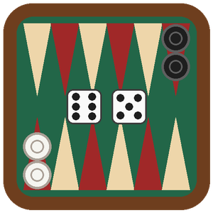

# BackgammonGameEngine



A .NET 10 engine for **табла**, the Bulgarian family of backgammon games, with strong computer players. It is a
reusable library for NuGet, written for game servers such as [ednaigra.com](https://ednaigra.com) and for any other
host.

| Version | What it is |
| --- | --- |
| Обикновена (права) | Standard backgammon without the doubling cube: hitting, the bar, марс for 2 points. |
| Гюлбара | All 15 checkers start on the 24 point and both players move the same way round. No hitting: one checker holds a point. Doubles escalate from the 4th roll. |
| Тапа | All 15 checkers start on the 24 point and the players move in opposite directions. A lone checker is pinned, not hit, and pinning the opponent's last checker on its start (майка) wins at once. |
| Челеби | Обикновена with гюлбара's escalating doubles. |
| Среща | The traditional match, rotating обикновена → гюлбара → тапа. |

## Packages

- **`BackgammonGameEngine`**: the rules and matches driven one action at a time.
  - Dice come from the host, in a documented order, so a provably fair host can verify every roll.
  - Per-seat views and records are plain JSON-serializable models, and a record replays its match exactly.
  - Move helpers support tap-to-move boards.
  - See [its README](src/Backgammon.Logic/README.md).
- **`BackgammonGameEngine.Bots`**: six levels for every version.
  - Level 6 is a TD-Gammon-style network per version, aware of the match score. Levels 1–5 add calibrated noise,
    at even rating steps.
  - A decision takes under 20 ms on one core.
  - See [its README](src/Backgammon.AI/README.md).

## Documents

- [RULES.md](RULES.md): the rules as the engine plays them, with every decision and its source.
- [NEURAL_NETWORK.md](NEURAL_NETWORK.md): the networks, their training, and how to reproduce them.
- [ARENA.md](ARENA.md): the levels' ratings, the networks against the baseline, decision times, match lengths.
- [docs/HOST.md](docs/HOST.md): how to plug the engine into a game server (ednaigra.com).
- [test-vectors/](test-vectors/README.md): JSON vectors for ports of the rules.

## Repository layout

```
src/Backgammon.Logic/      the engine (package BackgammonGameEngine)
src/Backgammon.AI/         the bots (package BackgammonGameEngine.Bots), with the trained networks
src/Tests/                 xUnit v3 tests: rules, differential, property, vectors, bots
tools/Backgammon.Arena/    vectors, arena, ladder, calibrate, timing, bench
tools/Backgammon.Trainer/  TD(λ) self-play training
test-vectors/              JSON test vectors
```

## Build and test

```
cd src
dotnet build Backgammon.slnx -c Release
dotnet test --solution Backgammon.slnx -c Release
```

Set `BACKGAMMON_LONG=1` for the full randomized runs. They compare the fast move generator with a naive one on 100k+
positions per version for all 21 rolls, and play 100k random games per variant, checking every invariant. They take
about an hour on 20 threads. The `Long tests` workflow runs them on demand.

## Releasing

Bump `<Version>` and `<PackageReleaseNotes>` in both csproj files, then publish a GitHub release whose tag is the
version. `.github/workflows/publish.yml` tests, packs and pushes both packages to nuget.org with Trusted Publishing.
The one-time setup is described at the top of that file.
